**********************************
Internet of Things Workshop Manual
**********************************

.. class:: center

| Michael Jonathan Lee
| June 2019

Setting up the virtual machine
##############################

Download the virtual machine image from 

`<link>`_

The code on the machine was written for the 
`Heltec WiFi Kit 32<https://heltec.org/project/wifi-kit-32/>`

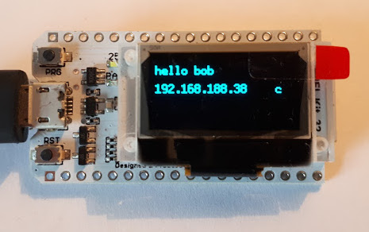

For communication between the virtual machine and the device ensure the following two
settings:

* the UART controller connected to the virtual machine

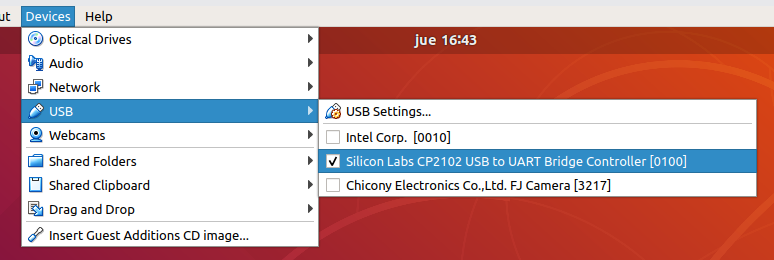

* give the virtual machine its own IP on the network through a bridged network adapter
        
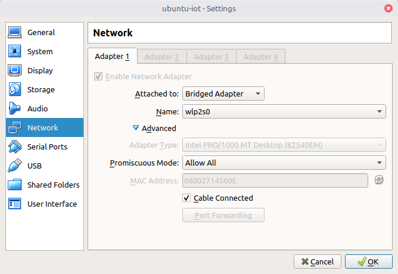

Running the Example
###################

What it does
------------

The central idea of the example is to have smart screens that display a message which we can
remotely be altered through an app, without physical access to the devices.

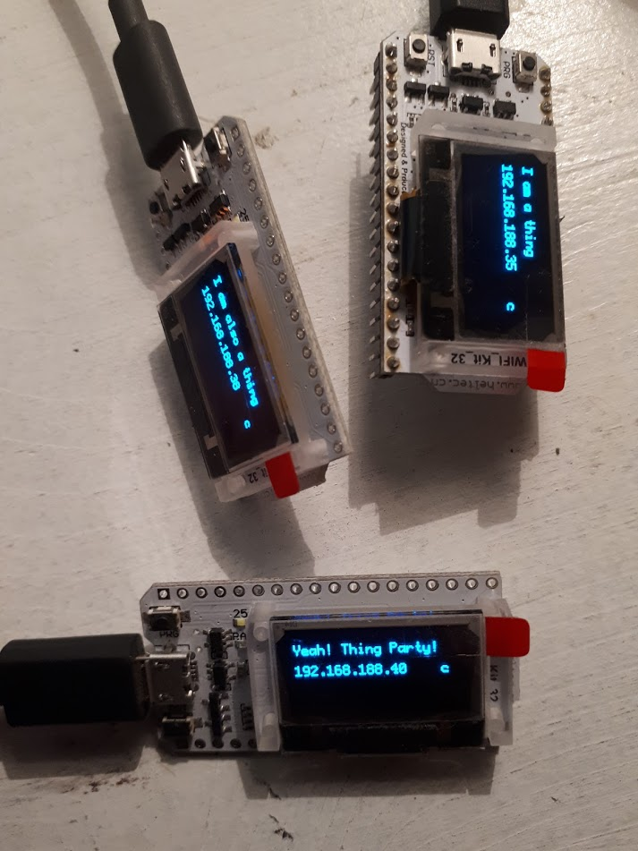

What we technically demonstrate is typical IoT 3 actor communication:

* up to three devices (``smartscreen-1, smartscreen-2, smartscreen-3``)
* a central backend
* an app for the user to control the devices

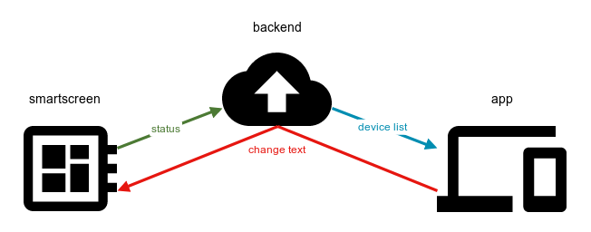

The following communication flow occurs:

* the backend has a list of known devices
* the backend tracks the last known IP address of each device
* when a device boots up, after connecting to the WiFi it will notify the backend of its status
* when the app loads it receives the device list from the backend
* if the app wishes to change the message on one of the screens it sends a request to the backend
* requests to change the message will be forwarded by the backend to the specific device via the
last known IP of that device

The educational focus of the example is not a set of best practices or libraries, but to
give an idea of where to get started with IoT.

Step 1: Startting the backend
-----------------------------

Go to the ``~/code/backend`` directory:

.. code:: bash

    cd ~/code/backend

Build the backend

.. code:: bash

    $ go build

Start the backend

.. code:: bash

    $ ./iot-backend

This will start a backend serving the app specific endpoints on port ``:3000`` and
the device specific endpoints on port ``:3001``

Step 2: Building and Flashing the Firmware
------------------------------------------

NOTE: The full name of the ESP-IDF framworks central tool command is ``idf.py``. On the virtual
machine the alias ``idf`` can be used.

Go to the ``~/code/firmware`` directory:

.. code:: bash

    $ cd ~/code/firmware

Start the menuconfig config editor:

.. code:: bash

    $ idf menuconfig

Make sure the entry

.. code::

    Component config -> ESP32-specific -> Main XTAL frequency

is set to 26MHz:

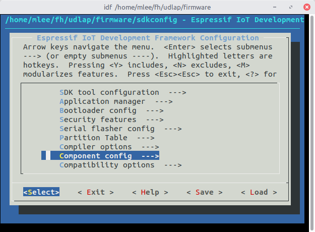

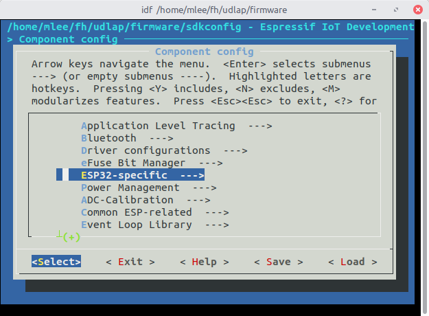

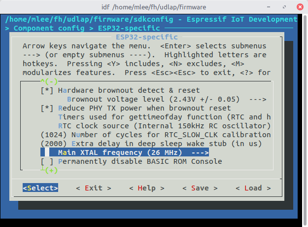

You will also have to set up the WiFi and backend address config in

.. cdoe::

    Component config -> smartscreen

* set the SSID and password of the WiFi network you want to use
* determine the virtual machine's IP address and set it as the ``home address``
* set which of the 3 available device IDs the device should have

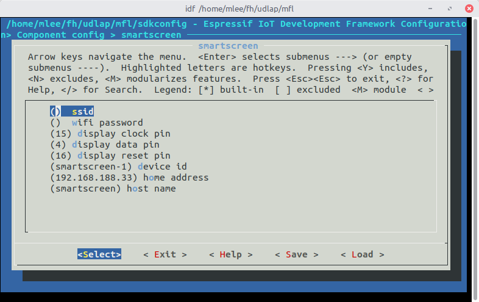

You can determine the IP address using ``ifconfig``:

.. code:: bash

    $ ifconfig

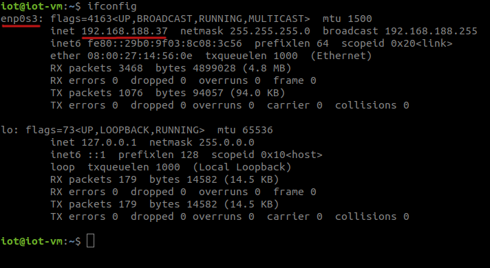

Compile the code:

.. code:: bash

    $ idf build

Flash the device with your firmware:

.. code:: bash

    $ idf flash

To view the log output:

.. code:: bash

    $ idf monitor

Step 3: Bundling and Building the App
-------------------------------------

Go to the ``~/code/app`` directory:

.. code:: bash

    $ cd ~/code/app

Install all dependencies:

.. code:: bash

    $ npm i

Start the app dev server:

.. code:: bash

    $ npm start

Now open a browser and launch the app by opening

.. code::

    http://localhost:8080

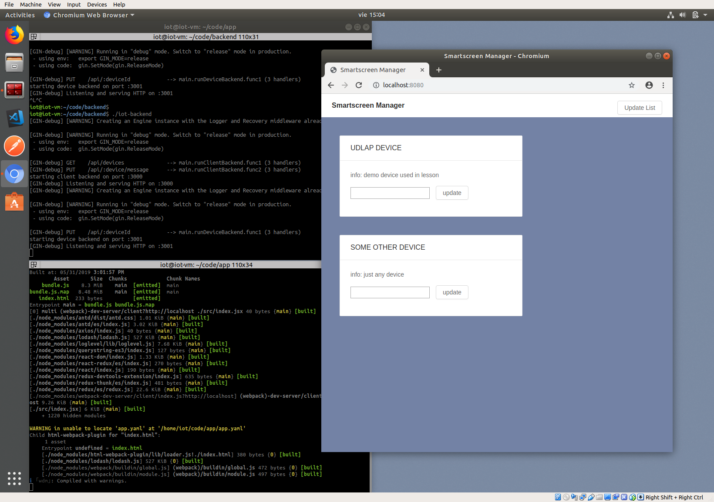
