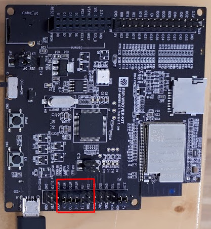

**********************************
Internet of Things Workshop Manual
**********************************

.. class:: center

| Michael Jonathan Lee
| June 2019

Contents
########

.. contents::

Setting up the virtual machine
##############################

Download the virtual machine image from 

`<link>`_

The code on the machine was written for the 
`Heltec WiFi Kit 32 <https://heltec.org/project/wifi-kit-32/>`_

For communication between the virtual machine and the device ensure the following two
settings:

* the UART controller connected to the virtual machine

.. image:: img/virtualbox-uart.png
    :align: center
    :width: 200

* give the virtual machine its own IP on the network through a bridged network adapter
        
.. image:: img/virtualbox-bridged-network-adapter.png
    :align: center
    :width: 200

Running the Example
###################

What it does
------------

The central idea of the example is to have smart screens that display a message which we can
remotely be altered through an app, without physical access to the devices.

.. image:: img/things.jpg
    :align: center
    :width: 300

What we technically demonstrate is typical IoT 3 actor communication:

* up to three devices (``smartscreen-1, smartscreen-2, smartscreen-3``)
* a central backend
* an app for the user to control the devices

The following communication flow occurs:

* the backend has a list of known devices
* the backend tracks the last known IP address of each device
* when a device boots up, after connecting to the WiFi it will notify the backend of its status
* when the app loads it receives the device list from the backend
* if the app wishes to change the message on one of the screens it sends a request to the backend
* requests to change the message will be forwarded by the backend to the specific device via the
last known IP of that device

The educational focus of the example is not a set of best practices or libraries, but to
give an idea of where to get started with IoT.

Step 1: Startting the backend
-----------------------------

Go to the ``~/code/backend`` directory:

.. code:: bash

    cd ~/code/backend

Build the backend

.. code:: bash

    $ go build

Start the backend

.. code:: bash

    $ ./iot-backend

This will start a backend serving the app specific endpoints on port ``:3000`` and
the device specific endpoints on port ``:3001``

Step 2: Building and Flashing the Firmware
------------------------------------------

.. note:: The full name of the ESP-IDF framworks central tool command is ``idf.py``. On the virtual machine the
    alias ``idf`` can be used.

Go to the ``~/code/firmware`` directory:

.. code:: bash

    $ cd ~/code/firmware

Start the menuconfig config editor:

.. code:: bash

    $ idf menuconfig

Make sure the entry

.. code::

    Component config -> ESP32-specific -> Main XTAL frequency

is set to 26MHz:

.. image:: img/idf-menuconfig.png

.. image:: img/menuconfig-esp32-specific.png

You will also have to set up the WiFi and backend address config in

.. cdoe::

    Component config -> smartscreen

* set the SSID and password of the WiFi network you want to use
* determine the virtual machine's IP address and set it as the ``home address``
* set which of the 3 available device IDs the device should have

You can determine the IP address using ``ifconfig``:

.. code:: bash

    $ ifconfig

.. image:: img/determine-ip.png

Compile the code:

.. code:: bash

    $ idf build

Flash the device with your firmware:

.. code:: bash

    $ idf flash

To view the log output:

.. code:: bash

    $ idf monitor

Step 3: Bundling and Building the App
-------------------------------------

Go to the ``~/code/app`` directory:

.. code:: bash

    $ cd ~/code/app

Install all dependencies:

.. code:: bash

    $ npm i

Start the app dev server:

.. code:: bash

    $ npm start

Now open a browser and launch the app by opening

.. code::

    http://localhost:8080

.. image:: img/app-and-backend.png

Debugging the ESP32
###################

Applications on the ESP32 can become very complex:

* the network stack requires multitasking
* the dual core setup can cause some complexity
* most likely SD or flash storage will occur
* frequent dynamic memory alloocation/deallocation is required in many of the ESP32's use cases

Error tracing through debug logs can become close to impossible if your firmware reaches
a certain complexity. Especially modern C++ tequniques can become very hard to debug
using logging. Also one could argue that logging is a terrible error tracing technique
anyway.

So we need a way of actually debugging the firmware on-chip. Fortunately the ESP32
supports
`JTAG debugging <https://blog.senr.io/blog/jtag-explained>`_
The
`setup process <https://docs.espressif.com/projects/esp-idf/en/latest/api-guides/jtag-debugging/>`_
is explained in detail in the ESP32 docs.
The biggest problem with JTAG debugging is, that your board layout has to support it
and that certain pins on the SoC become occupied by the debugger.
The Helltec WiFi Kit 32 does not have JTAG support out of the box. If you wish to debug
this specific board you would need to create a custom board with JTAG debugging support
and the same components the WiFi Kit 32 uses.

We will demonstrate the process of JTAG debugging using the
`ESP Wrover Kit 4.1 <https://docs.espressif.com/projects/esp-idf/en/latest/get-started/get-started-wrover-kit.html>`_
manufactured by Espressif.

.. image:: img/wrover-4.jpg

.. note:: All required tools are pre-installed on the virtual machine. No further setup is required.

NOTE: Unlike the WiFi Kit23, the Wrover Kit has a main crystal frequency of 40MHz so re-check your setting:

.. code::

    Component config -> ESP32-specific -> Main XTAL frequency

First of all make sure the highlighted jumpers on the back of the board are set for JTAG debugging:

The actual debugging is done via
`OpenOCD <http://openocd.org/>`_.
Will need to install the
`ESP32 specific version of OpenOCD <https://github.com/espressif/openocd-esp32/releases>`_.
Make sure you set the
``OPENOCD_SCRIPTS`` environmant variable to

.. code::

    <open ocd installation dir>/share/openocd/scripts

On linux systems configure the group of the

.. code::

    /dev/ttyUSB*

device files to bbe ``plugdev``.

If you want to use the virtual machine, connect to board:

To start the debug server run:

.. code:: bash
    openocd -f interface/ftdi/esp32_devkitj_v1.cfg -f board/esp-wroom-32.cfg

.. note:: On the virtual machine there is a pre-defined alias ``start-jtag`` for the command above.

OpenOCD will start a debug server that can be accessed be the
`GDB debugger frontend <https://www.gnu.org/software/gdb/>`_
debugger frontend

Go to the simple debugging sample project:

.. code:: bash

    cd ~/code/debug-sample

Build the code and flash the device:

.. code:: bash

    idf build && idf flash

and start the monitoring mode:

.. code:: bash

    idf monitor

Note that you will see some activity in the debugger window:

At this point you could simply run

.. code:: bash

    xtensa-esp32-elf-gdb build/debug-sample.elf

Let's be honest, running GDB in pure command line mode does not sound like much fun.
Thus the sample project comes with a debugging config for Visual Studio Code:

.. code:: json

    {
        "version": "0.2.0",
        "configurations": [{
            "name": "remote Wrover Kit debugging",
            "type": "cppdbg",
            "request": "launch",
            "program": "${workspaceFolder}/build/debug-sample.elf",
            "miDebuggerServerAddress": "localhost:3333",
            "args": [],
            "stopAtEntry": false,
            "cwd": "${workspaceFolder}",
            "environment": [],
            "externalConsole": true,
            "miDebuggerPath": "xtensa-esp32-elf-gdb",
            "MIMode": "gdb",
            "setupCommands": [{
                "description": "Enable pretty-printing for gdb",
                "text": "-enable-pretty-printing",
                "ignoreFailures": true
            }]
        }]
    }

Inside any ESP32 project, place this snippet in a

.. code::

     <project root>/.vscode/launch.json

file. Just make sure you replace the ``build/debug-sample.elf`` with your
executable name: ``build/<project name>.elf``

Now you can start the debugger from within Visual Studio Code and debug with all the
conveience of common debugger UIs:

.. image:: img/debugger-ui.png

Further Reading
###############

The App
-------

The web app can be found in the ``$HOME/code/frontend`` directory. The app was written
using the `React <https://reactjs.org/>`_ user interface library. For
application state handling the `Redux <https://redux.js.org/>`_ state container was
used. The Redux principles forbid using side effects on state changes. To handle side
effects like backend calls there is the very good
`Redux Saga library <https://redux-saga.js.org/docs/>`_.
Redux Saga requires some advanced understanding of JavaScript and thus for simplicity
the examples uses the simpler
`Redux Thunks library <https://github.com/reduxjs/redux-thunk>`_.
The actual backend calls are performed through the simple
`axios library <https://github.com/axios/axios>`_.
One piece of advice: Plain Redux causes lots of pointless boilerplate code. You are
well advised to use libraries such as
`Redux actions <https://github.com/redux-utilities/redux-actions>`_

There are very helpful dev tools for both
`React <https://github.com/facebook/react-devtools>`_
and
`Redux <https://github.com/zalmoxisus/redux-devtools-extension>`_.
The time travelling Redux debugger simplifies UI debugging to a great extent.
Open the developer tools on Chromium ``Ctrl-Shift-j``. You find the Redux and React
tabs in the top menu of the developer tools.

.. image:: img/redux-dev-tools.png

The code of the app needs to be preprocessed in order to create a single bundled
standard JavaScript file. The example uses the
`Babel <https://babeljs.io/>`_
JavaScript transpiler and polyfil. The bundling tool is
`WebPack <https://webpack.js.org/>`_
which also provides the dev server.

Most tools for web development rely on the `NodeJS <https://nodejs.org/en/>`_
JavaScript runtime. NodeJS is accompanied by the `NPM <https://www.npmjs.com/>`_
package manager, which was used in the example for package management. There is a
multitude of competing JavaScript package managers. A serious competitor (and at the same
time rather compatible) is
`Yarn <https://yarnpkg.com/en/>`_.

Due to it's dynamic nature JavaScript is great for testing and mocking. The application
core logic can easily be tested, since it is all centralized in the Redux reducer
function. Although this example does not come with any testing, it could be advisible
to take a look at the Jest
`Jest <https://jestjs.io/>`_
testing ecosystem. Jest provides a test runner, coverage analysis and mathchers with
a zero configuration approach.

The Backend
-----------

The backend was written using the
`Go programming language <https://golang.org/>`_.

The Go langauge has the advantages of a type safe statically compiled
language combined with a very compact syntax, that can be as elegant as a scripting
language at times. Go has some of the advantages of Java
(reflection, modules, heap garbage collection)
and some of the advantages of C++ (native compilation, stack and heap storage).

Go also comes with efficient concurrency:

* it uses a thread pool combined with execution fibers
* there is a special ``go`` keyword for async execution
* there is s special ``chan`` data type for inter-thread communication

The example also uses the `Go modules <https://blog.golang.org/using-go-modules}
feature, which improves the build in package management of the Go language.

The HTTP REST backend framework used is
`Gin <https://github.com/gin-gonic/gin>`_
Gin is an easy to use fast framework, in which HTTP enpoints are defined in a
programmatic manner like many NodeJS frameworks (
`Express <https://expressjs.com/>`_ and
`Koa <https://koajs.com/} for example>`_).

For simplicity the example does not feature a database storage. Go has many well
designed libraries for database persistence. Using either a document database like
`Mongo DB <https://www.mongodb.com/>`_}
through
`official driver <https://github.com/mongodb/mongo-go-driver}
or a modern relational database like
`PostgreSQL <https://www.postgresql.org/>`_
through libraries like
`Postgress GO ORM <https://github.com/go-pg/pg>`_
is very straight forward and mostly painless. Through tags (limilar to Java annotations)
class member serialization and validation can be controlled in a nice declarative way.

For testing in Go behaviour driven testing libraries like
`Ginkgo <https://github.com/onsi/ginkgo>`_
provide a nice and elegant solution.

A last remark on app backend communication: The example uses classical CRUD
where every call queries or mutates a single resource or a list of resources of the same
type, using HTTP verbs and JSON encoding.
With
`GraphQL <https://graphql.org/learn/>`_
you can provide a more elegant solution, without having to write more code or use
intrusive monstrous frameworks. Especially non mutationg backend queries benefit a lot
from using GraphQL for app backend communication.

The Firmware
------------

There is extensive
`documentation <https://docs.espressif.com/projects/esp-idf/en/latest/>`_
available on the ESP32 chip, libraries and tools.

The example firmware was written using the
`ESP IDF framework <https://github.com/espressif/esp-idf>`_
which is maintained by Espressif and completly open source, like most of the ESP32
ecosystem. The framework is available as a
`Git <https://git-scm.com/>`_ repo. To update the framework just use

.. code:: bash
    $ git pull

to fetch the newest version of the framework's master branch (some care must be taken due
to the use of submodules though).

ESP IDF providtes libraries for all the units on the ESP32 SoC and lots of higher level
libraries on top of that. Everything from reading anlaog values, from using the ESP32
as a WiFi hotspot is featured withing the framework. The framework also provides the
``idf.py`` utility, to build flash and monitor firmware. The newest version of
the ESP IDF supports either classical make files or more modern
`CMake <https://cmake.org/>`_.

The
`current ESP32 toolchain <https://docs.espressif.com/projects/esp-idf/en/latest/get-started/index.html#get-started-setup-toolchain>`_
comes with a GCC 5 compiler. There is a
`preview version of GCC 8 <https://github.com/espressif/crosstool-NG/releases/tag/esp32-2019r1-rc2>`_
available, that you may need to compile yourself. This newer cross compilation
toolchain version is provided with the virtual machine.

To actually use new C and C++ language features put the following lines into your
projects roots CMake file

.. code:: cmake

    set(CMAKE_CXX_STANDARD 17)
    set(CMAKE_CXX_STANDARD_REQUIRED ON)
    set(CMAKE_C_STANDARD 99)
    set(CMAKE_C_STANDARD_REQUIRED ON)

The example also used two other libraries:

* `u8g2 <https://github.com/olikraus/u8g2>`_: a nice library for monochrome displays
* `JSON for modern C++ <https://github.com/nlohmann/json>`_: a state of the art JSON library
